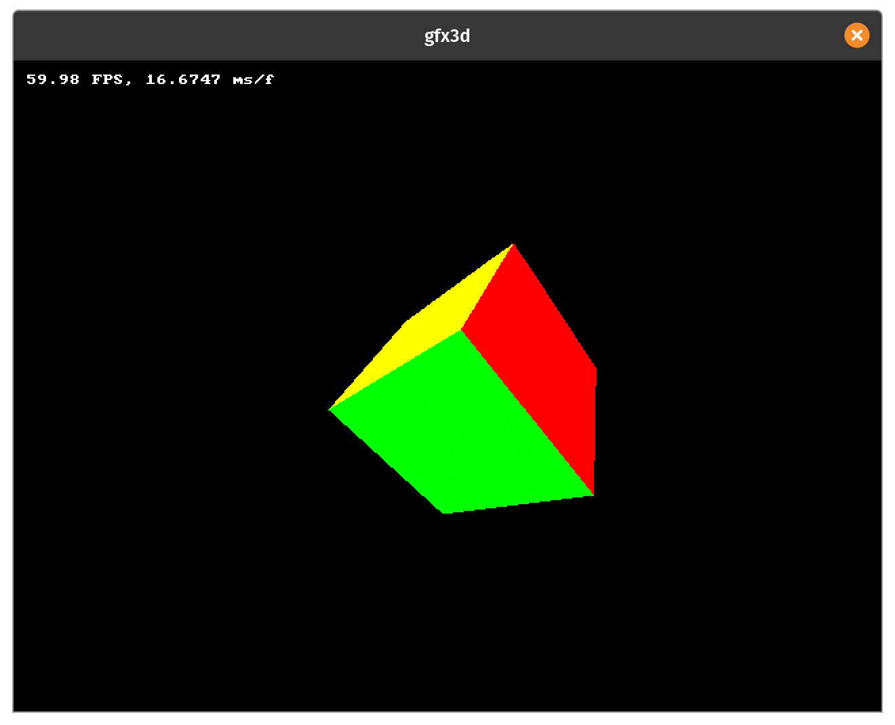

# gfx3d

A software implementation of a fixed function 3d graphics pipeline built for learning purposes. It is currently a work-in-progress.



## Compile and Run

I use linux, so the Makefile has only tested been tested on my PC.

Install SDL2:

```shell
sudo apt install libsdl2-dev
```

Compile the code:

```shell
make
```

Run the program:

```shell
./build/release/gfx3d
```

To compile for debugging use the `DEBUG` flag.

```shell
make DEBUG=1
```

```shell
./build/debug/gfx3d
```

## References:
- https://www.scratchapixel.com/lessons/3d-basic-rendering/rasterization-practical-implementation/visibility-problem-depth-buffer-depth-interpolation
- https://www.scratchapixel.com/lessons/3d-basic-rendering/rasterization-practical-implementation/perspective-correct-interpolation-vertex-attributes
- https://www.amazon.com.au/Math-Primer-Graphics-Game-Development/dp/1568817231
